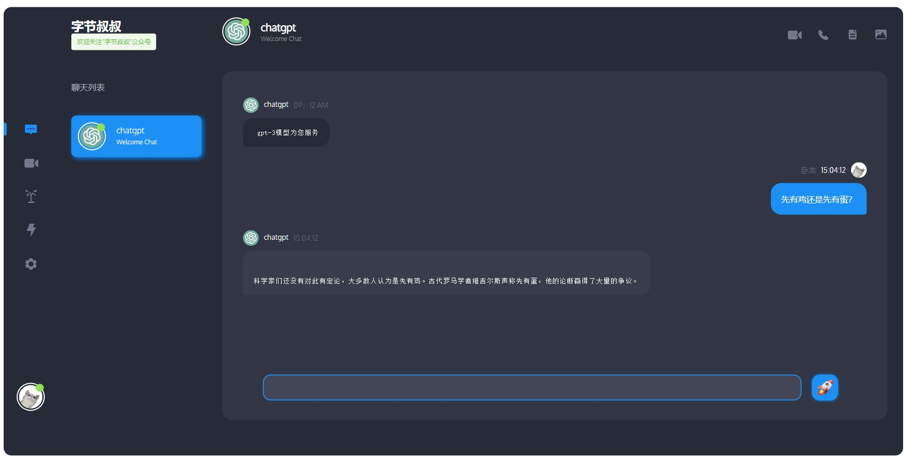
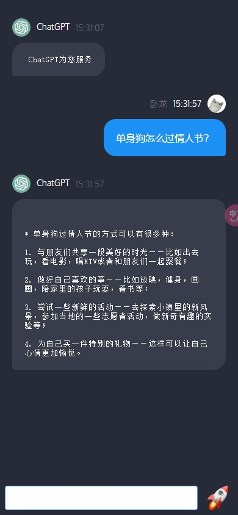

## 使用前提
* 有Openai账号，并且创建好`api_key`，注册相关事项可以参考[此文章](https://juejin.cn/post/7173447848292253704) 。访问[这里](https://beta.openai.com/account/api-keys)，申请个人秘钥。
* 本项目需要提前注册好OpenAI并拿到API KEY，然后在项目api/getData.js中的chatgpt方法中修改Authorization内容即可。
* ChatHome页面是pc端，连接方式是直接通过http调用openai接口。
* MobileChat页面移动端，通过websocket实现，需要后端支持,项目地址如下。
github: https://github.com/zccbbg/chatgpt-springboot-service
gitee: https://gitee.com/zccbbg/chatgpt-springboot-service

## 项目启动
`npm install`

`npm run serve`

## 项目预览

> 该项目基于 https://gitee.com/mao-yongyao/chatroom 进行二次开发