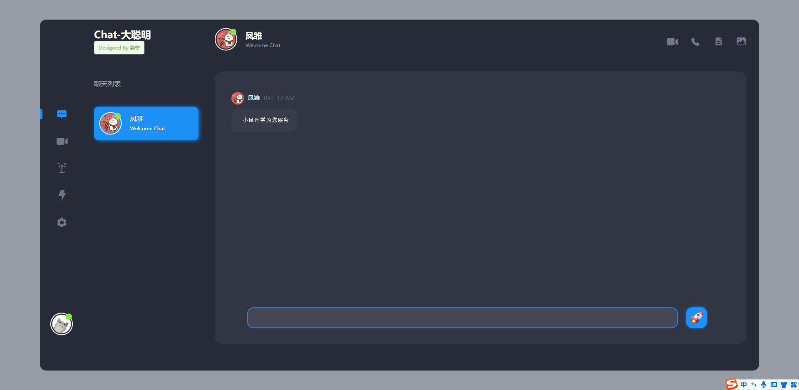
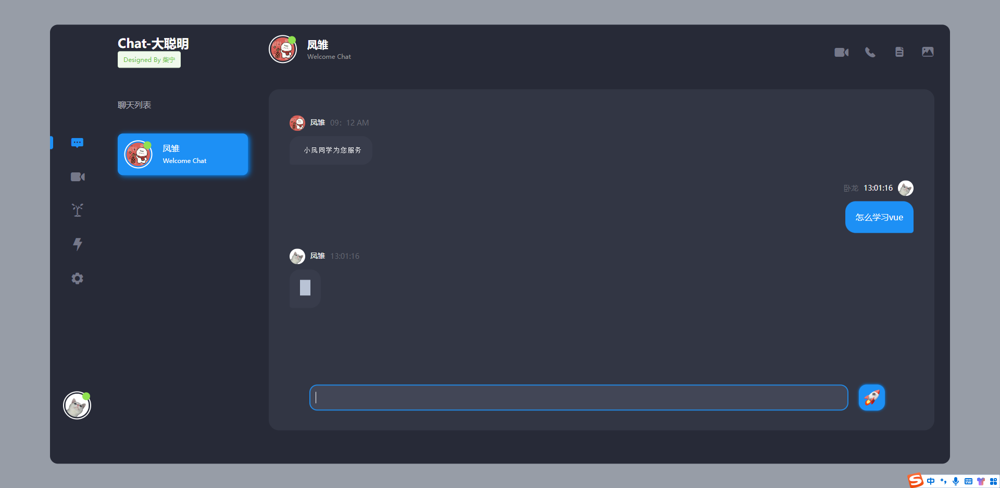
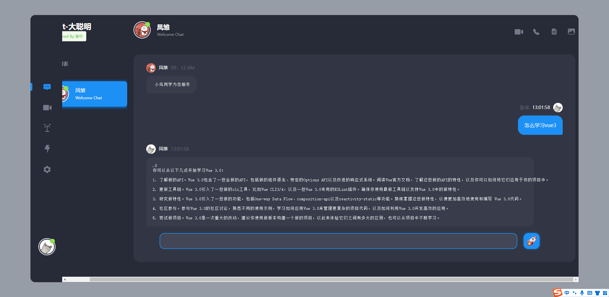

ChatGPT模型是由OpenAI训练的大型语言模型，能够生成类人文本。通过向它提供提示，它可以生成继续对话或扩展给定提示的响应。由于目前ChatGPT并未向我们开放注册，所以想要体验要大费周折。

本项目需要提前注册好OpenAI并拿到API KEY，然后在项目api/getData.js中的chatgpt方法中修改Authorization内容即可。

## 项目启动
`npm install`

`npm run serve`

## 项目预览

> 该项目基于 https://gitee.com/mao-yongyao/chatroom 进行二次开发